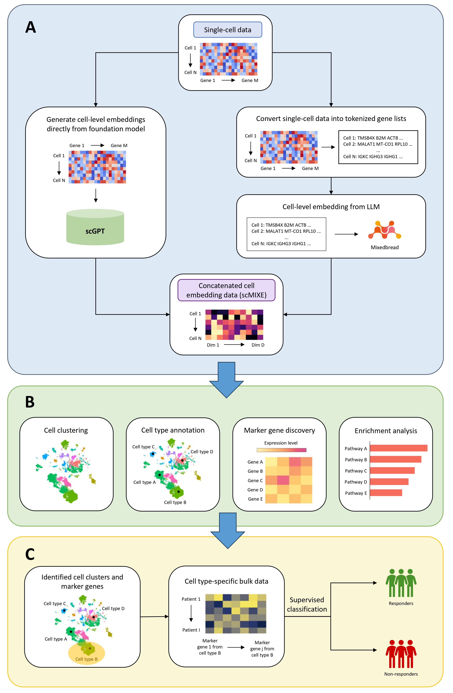

This repository contains all code, scripts, and results for the research project titled **PRECISE: Cell-Type Inference from Single-Cell Embeddings Enhances Prediction of Breast Cancer Immunotherapy Response.**  

---
## PRECISE: Prediction of REsponse using Cell-type Inference and Single-cell Embedding

  
   

  <em>
  PRECISE framework for predicting treatment outcomes from single-cell data. 
  <strong>A.</strong> Single-cell embeddings are generated either directly from a foundation model (scGPT) or via LLM-derived embeddings (Mixedbread), which are concatenated to produce integrated representations (scMIXE). 
  <strong>B.</strong> Downstream single-cell analyses are performed to define cell populations and extract gene signatures, including clustering, cell type annotation, marker gene discovery, and enrichment analysis. 
  <strong>C.</strong> The PRECISE framework integrates the cell type-specific features into patient-level bulk data and applies supervised classification to predict treatment outcomes (responders vs. non-responders).
  </em>

---

## Repository Structure

### `embedding generation/`  
Contains scripts used to generate embeddings.

- **`scgpt_embeddings.ipynb`** - Colab Python notebook used to generate scGPT embeddings and save them for downstream processing in R. Embedding concatenation of scGPT and Mixedbread to generate scMIXE was performed in this notebook.
- **`generate_gene_name_sequences.R`** R code was used to generate the gene name sequences for Mixedbread embedding. 
- **`mixedbread_embeddings.ipynb`** - Colab Python notebook generates Mixedbread embeddings for all single-cell samples.

---

### `downstream analysis/`  
Contains scripts for clustering, marker gene identification, and cell type annotation across different data representations, followed by standardized marker filtering and gene set enrichment analysis.

- **`raw_data_analysis.R`** – Analyzes raw single-cell expression data from ([Bassez et al. data](https://lambrechtslab.sites.vib.be/en/single-cell))
- **`individual_embedding_analysis.R`** – Analyzes single-cell embeddings generated by scGPT or Mixedbread embeddings
- **`scMIXE_analysis.R`** – Analyzes scMIXE (concatenated) embeddings 

---

### `treatment outcome prediction/`
- Contains Colab Python notebooks used to predict treatment response outcomes based on bulk gene expression and scMIXE-derived marker genes.

--- 

## Foundation Models Used
- [scGPT](https://github.com/bowang-lab/scGPT)
- [Mixedbread](https://www.mixedbread.com/docs/inference/embedding)

---

## Data Access
- [Bassez et al. data](https://lambrechtslab.sites.vib.be/en/single-cell)
- [I-SPY2 data](https://www.ncbi.nlm.nih.gov/geo/query/acc.cgi?acc=GSE194040)

---

## Environment  
Code was developed and run in:
- R (version ≥ 4.2.0)
- Python 3.10+
- Google Colab Pro (L4 GPU for embedding extraction)

--- 

## Acknowledgements
Thank you to Dr. Pingzhao Hu for his guidance and support throughout this project. 

